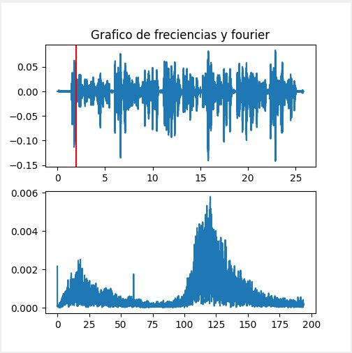
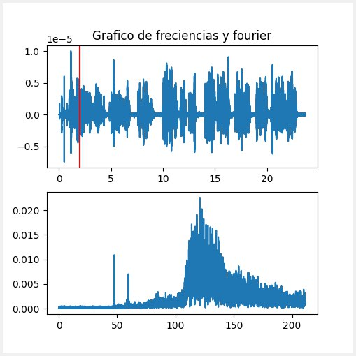
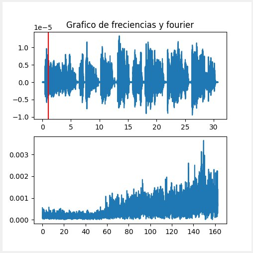

##### Ingeniería en Computación
##### Curso: Redes
##### Yerlyn Guerrero León  2018175922
##### Alejandro Centeno Chaves 2017169579
##### Dylan González Quesada 2017118729   

&nbsp;  

# **Tarea corta #1- Autrum**

&nbsp;

## **¿Porqué las voces de Alejandro, Yerlyn y Dylan son diferentes?**

Para iniciar, el objetivo principal de este documento es dar la explicación del porqué tres personas indiferentemente de su sexualidad cuentan con voces totalmente distintas basándose en los gráficos de Fourier y como estos los captan y llevan a cabo. Ahora bien, antes de comenzar es importante destacar un pequeño ejemplo de cómo este proceso se realiza.

Debemos conocer varias definiciones antes para poder entender con claridad la respuesta a esta pregunta. Empezaremos con el análisis armónico en el cual se puede observar los armónicos de un sonido que tiene un determinado timbre. Para lograr este análisis se tiene el teorema de Fourier el cual nos viene a decir algo similar a lo siguiente: *"Cualquier forma de onda, a condición de que sea periódica (se repite siempre igual) se puede descomponer en una serie más o menos larga (quizás infinita) de ondas puras (senoidales) llamadas armónicos. Estos armónicos son tales que su combinación o mezcla dan lugar de nuevo al sonido original, y sus frecuencias son múltiplos enteros de la del sonido fundamental."* (Plaza, 2022)

Además, basado en el teorema de Fourier se nos explica que los objetos, al vibrar, excitan la masa del aire que los rodea y generan una perturbación que viaja por el aire propagándose en forma de onda, la cual al llegar al oído humano, pone en vibración ciertas estructuras anatómicas que desencadenan ciertas respuestas neurológicas y psicológicas implicadas en la percepción del sonido.

Prosiguiendo con el tema, en cuanto más ancha sea una vibración por consiguiente más intenso será el sonido que produzca, dependiendo también en gran parte del timbre y armónicos mencionados anteriormente que son múltiplos fundamentales, la vibración llega a provocar una onda sonora o tono fundamental y unos armónicos que al ser filtrados en la cavidad bucal y en la nasal producen el timbre del sonido y por ende la voz como la conocemos.

Además de los conceptos ya mencionados no podemos dejar de la lado la diferencias fisiológicas que existen, debido a que la mujer cuenta con una laringe y cuerdas vocales más reducidas por ende su tendencia suele ser más agudo, en el caso de los hombres la laringe suele ser de mucho mayor amplitud en comparación a la de las mujeres produciendo así un sonido más grave.

Para mostrar un poco sobre las diferencias de los armónicos entre las voces de los integrantes del equipo de trabajo se mostrarán imágenes del programa graficando audios con las voces de cada uno. Para este ejemplo se le pide a los integrantes grabarse diciendo el siguiente pasaje de Alicia en el país de las maravillas:

*"La Falsa Tortuga suspiró profundamente y se enjuagó una lágrima con la aleta. Antes de hablar, miró a Alicia durante bastante tiempo, mientras los sollozos casi la ahogaban. —Se te ha atragantado un hueso, parece— dijo el Grifo poco respetuoso. Y se puso a darle golpes en la concha por la parte de la espalda. Por fin la Tortuga recobró la voz y reanudó su narración, sólo que las lágrimas resbalaban por su vieja cara arrugada"*

Seguidamente de tener la grabación, se ejecutan en el Autrum y se logra visualizar los siguientes gráficos:

* Alejandro:

Como se puede apreciar, en el gráfico de Fourier de la voz del compañero Alejandro la concentración de frecuencias más elevadas está en un intervalo de 100Hz a 150Hz.

&nbsp;

* Dylan:

En el caso del compañero Dylan, en el gráfico de Fourier creado de su voz, se puede apreciar que el intervalo de frecuencias anda aproximadamente entre los 100Hz a 150Hz similar a las de Alejandro.

&nbsp;

* Yerlyn:

En el caso de la compañera Yerlyn, se puede observar que su voz cuenta con una mayor concentración de frecuencias en un intervalo desde los 140Hz a 160Hz

&nbsp;

Según *Vozalia* la voz masculina se encuentra en un rango de 77Hz a 482Hz. En cuanto a la voz femenina está en un rango de 137Hz a 634Hz, lo cual podríamos observar que las voces de los compañeros y la compañera se encuentran dentro de las frecuencias que se mencionan anteriormente confirmando lo que anteriormente se comentaba de que las características fisiológicas también son un aspecto importante a denotar.

Cabe recalcar que por el hecho de que las personas grabaron en diferentes lugares y con diferentes dispositivos, el gráfico puede verse influenciado por este ruido, haciendo que los datos no sean totalmente verídicos.
&nbsp;

## **Referencias**

* Vozalia. (2020, 10 septiembre). *La voz humana. Decibelios y frecuencia de la voz humana.* Recuperado 17 de marzo de 2022, de https://www.vozalia.com/voces/la-voz-humana-decibelios-y-frecuencia-de-la-voz-humana/

* Plaza, E. (2015). *Teorema de Fourier – Matemáticas de la música.* Recuperado 17 de marzo de 2022, de http://lcr.uns.edu.ar/fvc/NotasDeAplicacion/FVC-EstebanPlaza.pdf