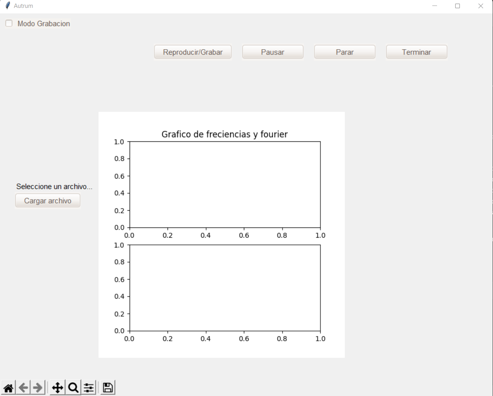
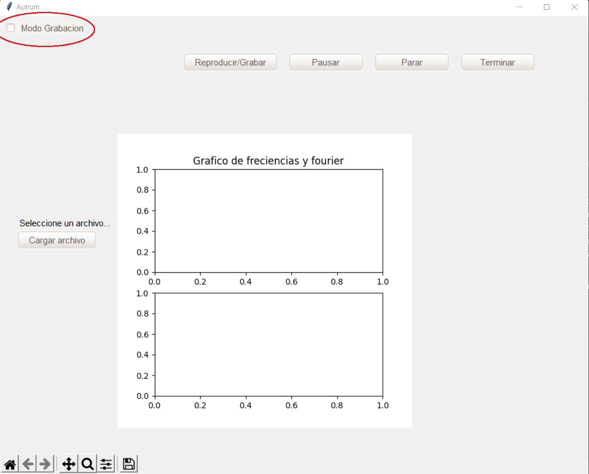
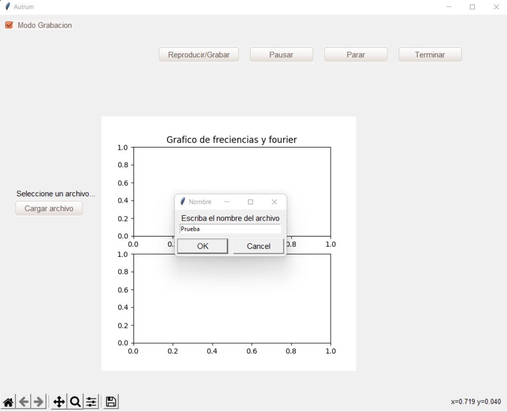
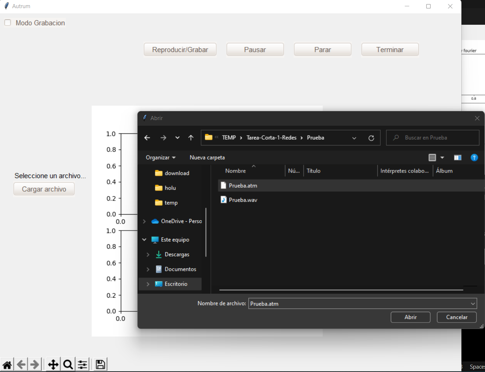
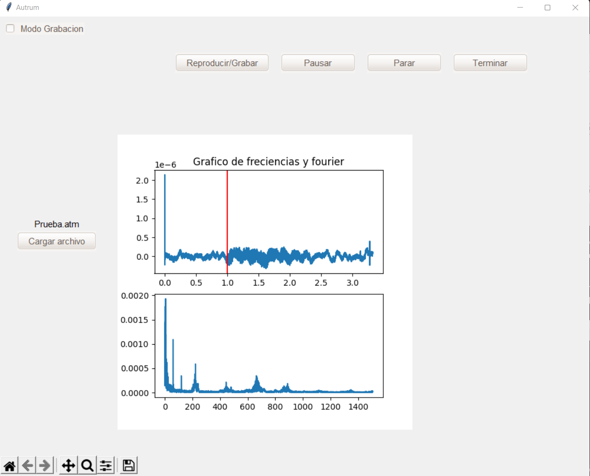

# Tarea-Corta-1-Redes

Para correr el proyecto se debe instalar los siguientes paquetes.

* [python](https://www.python.org/downloads/): Actualmente se trabaja con la versión de Python 3.10.2

* [pyAudio](https://www.lfd.uci.edu/~gohlke/pythonlibs/#pyaudio): Se trabaja con PyAudio‑0.2.11‑cp310‑cp310‑win_amd64.whl

* [matplotlib](https://matplotlib.org/2.0.0/users/installing.html)

* [soundfile](https://pypi.org/project/SoundFile/)

* [tkinter](https://www.geeksforgeeks.org/how-to-install-tkinter-in-windows/)

* [mutagen](https://pypi.org/project/mutagen/)

* [pygame](https://www.geeksforgeeks.org/how-to-install-pygame-in-windows/)

* [wave](https://pypi.org/project/Wave/)

&nbsp;

## **Ejecución**

1. El programa se ejecuta con el siguiente comando:

        $ python Autrum.py

2. Una vez ejecutado aparecerá una ventana como la siguiente:

3. Dentro de la ventana se podrá observar en la esquina superior izquierda un checkbox el cúal es para activar el modo grabación, una vez se le de click al ckeckbox se presiona el botón **Reproducir/Grabar** y el programa empieza a grabar.

4. Una vez ya terminada la grabación se presiona el botón de **Terminar** con la cual aparecerá una ventana en el que se pondrá el nombre del archivo grabado *(sin extensión)*.

5. Por último, para reproducir el audio que acabamos de grabar, se quita el check del **Modo grabación** se buscar el archivo *.atm* y se le da click al botón **Reproducir/Grabar**.

